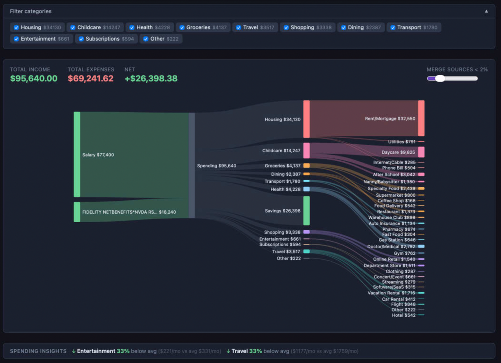
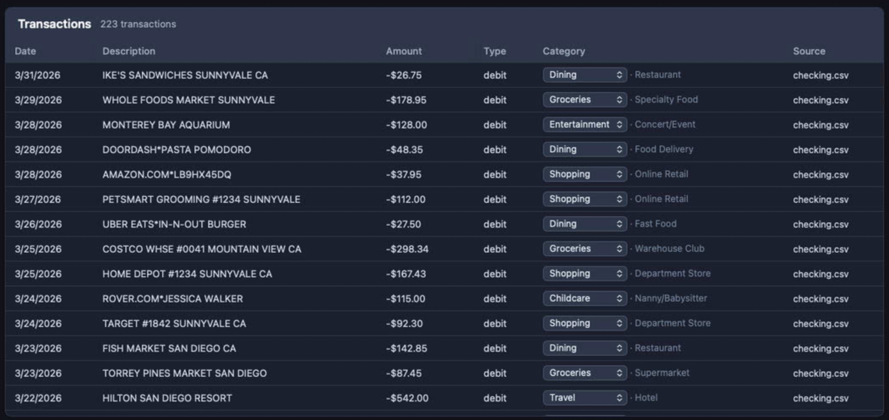
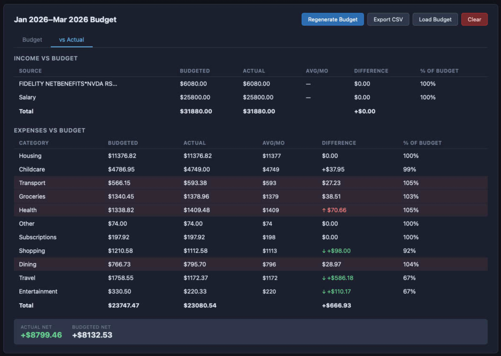
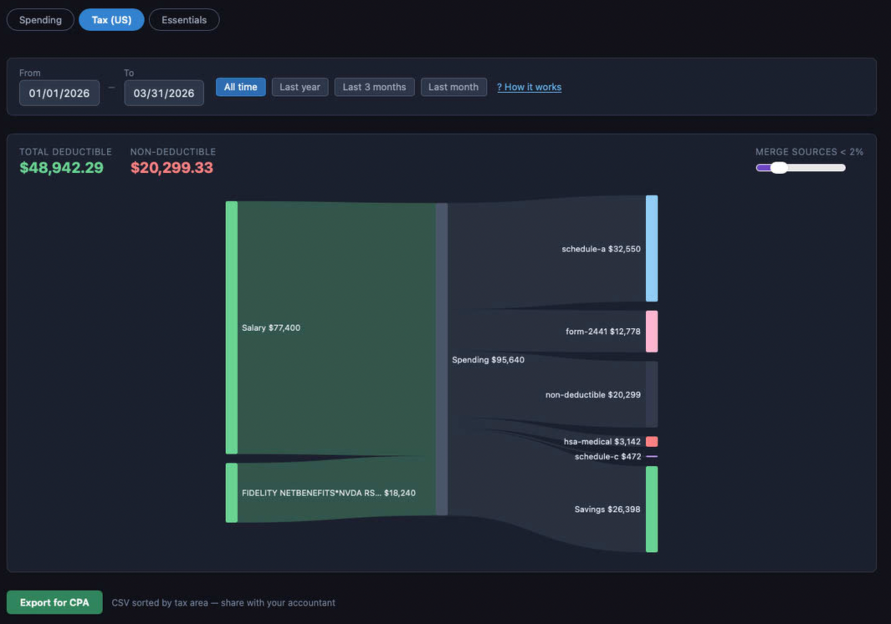
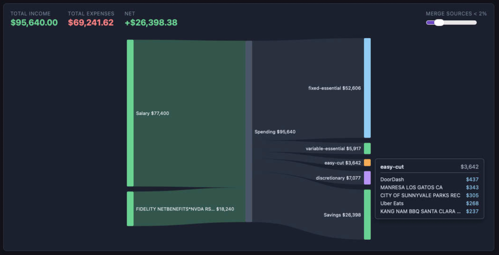
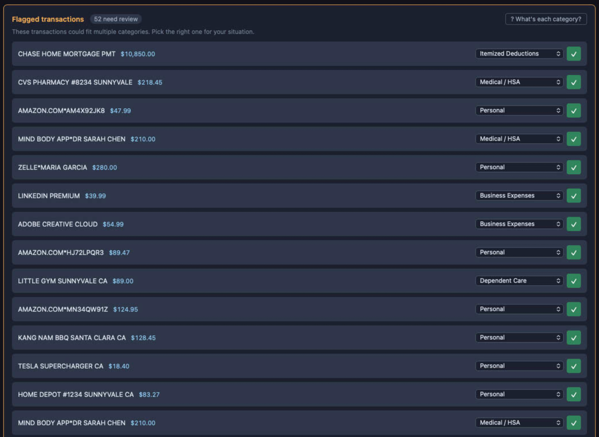

# WhoAteMyPaycheck

Drag-drop your bank CSVs, see where your money went.

Export CSVs from your banks and credit cards, drop them in, and get an interactive Sankey diagram of your income and spending — no account linking, no sign-up, no data leaving your browser.



---

## How it works

1. **Export CSVs** from your bank(s) — Chase, BofA, Amex, Monzo, credit unions, most others work out of the box
2. **Drop them in** — the app auto-detects each bank's column layout, date format, and amount convention
3. **Categorize** — click "Categorize with Claude" and your transactions get sorted into spending categories
4. **Explore** — interactive Sankey diagram shows income → spending flow; hover any category for a top-5 vendor breakdown; filter by date range

The app handles multi-file uploads (checking + credit card + savings in one go), detects transfers between your own accounts so they don't inflate your totals, and flags month-over-month spending anomalies automatically.

---

## What you can do with it

### Spending breakdown

The main view maps every dollar from income sources through to spending categories. Subcategories appear on the right in detailed mode. The category filter bar lets you hide large fixed costs (rent, mortgage) to zoom in on discretionary spending.


### Transaction table

Every transaction is listed with its AI-assigned category and subcategory. You can override any category from the dropdown — corrections are reflected immediately in the Sankey.



### Budget vs actual

Generate a budget from your actual spending history — the app detects fixed recurring items (rent, Netflix), variable predictable bills (utilities), and discretionary categories (dining, shopping). Compare against actuals with per-month averages and ↑↓ sentiment indicators.



### US Tax lens

Switch to the Tax (US) lens to see your spending organized by IRS area: Schedule A itemized deductions, Schedule C business expenses, Form 2441 dependent care, HSA-eligible medical, and non-deductible. Export a CSV sorted by tax area to share with your accountant.



### Essentials lens

See your spending bucketed into fixed essentials (housing, healthcare), variable essentials (groceries, transport), easy cuts (subscriptions, dining), and discretionary — a quick read on where the flexibility is.



### Tax transaction review

The tax lens flags transactions that could fit multiple IRS categories for your review. Pick the right classification for each — the Sankey and export update immediately.



---

## Privacy

**Your bank data never leaves your browser.**

- All CSV parsing and processing runs locally in the page
- The only outbound network call is to the Claude API for transaction categorization
- That call sends merchant names and amounts only — **account numbers are never sent**
- Your Claude API key is stored in `sessionStorage` (cleared when you close the tab, never sent anywhere except Anthropic's API)
- No analytics, no telemetry, no server of any kind

This is the core design constraint, not an afterthought. The reason the app exists is that connecting real bank credentials to a third party is a significant trust ask. CSV export sidesteps that entirely.

### What goes to the Claude API

When you click "Categorize", the app sends batches of transaction descriptions in this shape:

```json
[
  { "id": "tx-42", "description": "WHOLEFDS MKT #10", "amount": 47.82 },
  { "id": "tx-43", "description": "SHELL OIL 57442",  "amount": 62.10 }
]
```

No dates. No account numbers. Claude reads the merchant name and amount and returns a category.

---

## Getting started

You'll need a Claude API key from [console.anthropic.com](https://console.anthropic.com). The categorization step uses Claude Sonnet, which costs roughly $0.003 per 1,000 transactions — a full year of data typically runs a few cents.

1. Open the app and paste your API key into the key field (it's only kept for the current tab session)
2. Drag your CSV exports onto the drop zone — you can load multiple files at once
3. Click **Categorize with Claude**
4. Use the date range buttons to filter by period; hover expense nodes for vendor breakdowns

### Supported CSV formats

The app auto-detects format — you don't need to configure anything. Tested against:

| Bank | Date format | Amount style |
|------|-------------|--------------|
| Chase Checking | MM/DD/YYYY | Single `Amount` column, negative = credit |
| Bank of America Credit Card | MM/DD/YYYY | Positive = charge, negative = payment |
| American Express | MM/DD/YYYY | `(NNN.NN)` parenthetical = charge |
| Generic Credit Union | YYYY-MM-DD | Separate `Debit` / `Credit` columns |
| Monzo (UK) | DD/MM/YYYY | `Paid out` / `Paid in` columns, GBP |

Most other banks follow one of these patterns and will work without any configuration.

---

## Spending categories

Transactions are sorted into 13 categories:

| Category | What goes here |
|----------|---------------|
| **Groceries** | Supermarkets, warehouse stores, grocery delivery (Instacart) |
| **Dining** | Restaurants, coffee shops, food delivery apps, fast food |
| **Housing** | Rent, mortgage, utilities, internet, phone bill, renters insurance |
| **Transport** | Gas stations, rideshare trips, public transit, parking |
| **Travel** | Flights, hotels, Airbnb, vacation rentals |
| **Shopping** | Amazon, retail stores, electronics, clothing |
| **Health** | Pharmacies, doctors, dentists, gym memberships |
| **Subscriptions** | Streaming, SaaS, recurring software (Netflix, Spotify, Adobe…) |
| **Entertainment** | Bars, concerts, events, alcohol |
| **Childcare** | Daycare, babysitters, after-school programs |
| **Education** | Tuition, school fees, tutoring, books |
| **Income** | Salary, side income, interest, tax refunds |
| **Transfer** | Transfers between your own accounts (auto-detected, excluded from totals) |
| **Other** | Anything unrecognized |

You can override any category from the transaction table.

---

## Running locally

```bash
npm install
npm run dev
```

Requires Node 18+. There's no backend — `npm run dev` is the whole stack.

```bash
npm test      # unit tests (Vitest)
npm run build # production build
npm run lint  # ESLint
```

### Sample data

`public/samples/` contains synthetic CSVs covering a full year of realistic transactions. Drop them in to test parsing and categorization without using real bank data.
